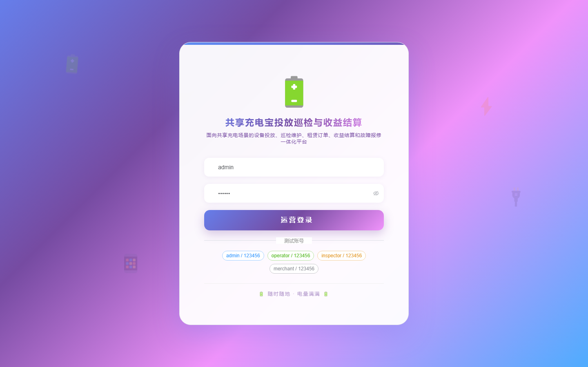

# 198 - 城市共享充电宝投放巡检与收益结算系统

## 项目信息

- 项目编号：`198`
- 组件类型：`backend, frontend`
- 后端入口：`http://127.0.0.1:8198`
- 前端入口：`http://127.0.0.1:3198`
- 账号来源：未识别
- 已收录截图：`16` 张

## 默认账号

- 暂未自动识别到默认账号

## 预览截图

### guest

#### guest-01-dashboard

#### guest-01-login

#### guest-02-register

#### guest-02-user

#### guest-03-site

#### guest-04-cabinet

#### guest-05-device

#### guest-06-plan

#### guest-07-inspection

#### guest-08-repair

#### guest-09-recycle

#### guest-10-order

#### guest-11-income

#### guest-12-settlement

#### guest-13-transfer

#### guest-14-log

