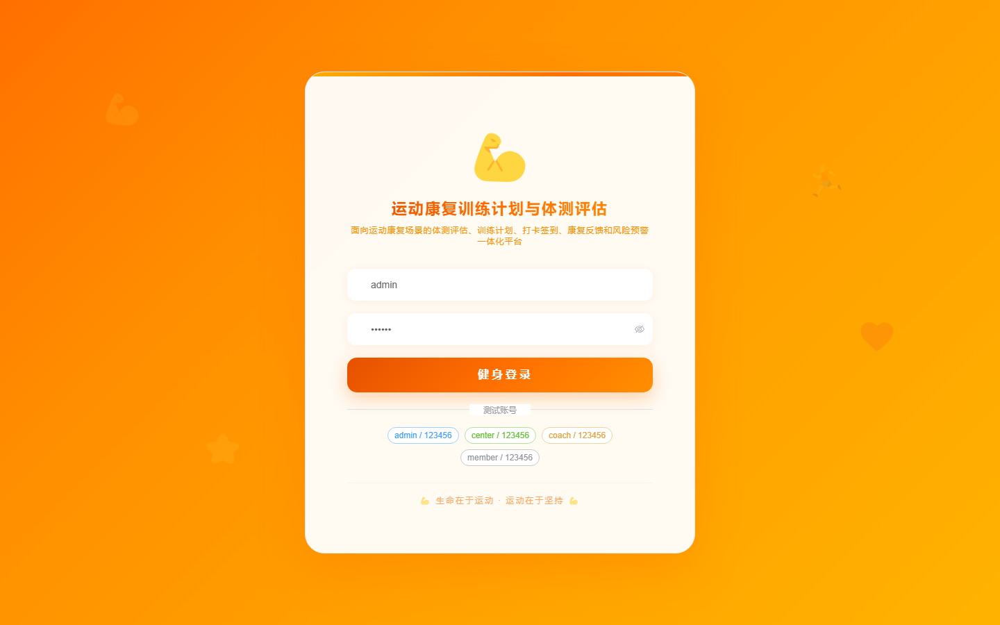

# 199 - 运动康复训练计划与体测评估管理系统

## 项目信息

- 项目编号：`199`
- 组件类型：`backend, frontend`
- 后端入口：`http://127.0.0.1:8199`
- 前端入口：`http://127.0.0.1:3199`
- 账号来源：未识别
- 已收录截图：`16` 张

## 默认账号

- 暂未自动识别到默认账号

## 预览截图

### guest

#### guest-01-dashboard

#### guest-01-login

#### guest-02-register

#### guest-02-user

#### guest-03-center

#### guest-04-member

#### guest-05-coach

#### guest-06-item

#### guest-07-assessment

#### guest-08-risk

#### guest-09-plan

#### guest-10-session

#### guest-11-checkin

#### guest-12-feedback

#### guest-13-reassessment

#### guest-14-log

