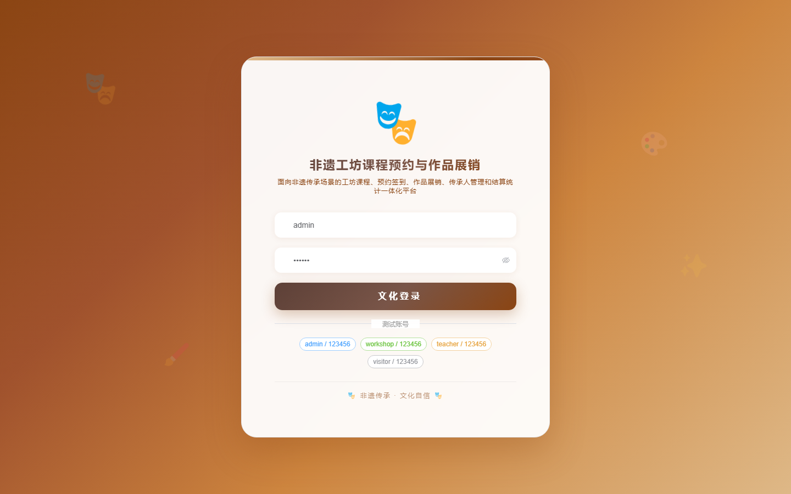

# 200 - 非遗工坊课程预约与作品展销平台 🔥最新

## 项目信息

- 项目编号：`200`
- 组件类型：`backend, frontend`
- 后端入口：`http://127.0.0.1:8200`
- 前端入口：`http://127.0.0.1:3200`
- 账号来源：未识别
- 已收录截图：`16` 张

## 默认账号

- 暂未自动识别到默认账号

## 预览截图

### guest

#### guest-01-dashboard

#### guest-01-login

#### guest-02-register

#### guest-02-user

#### guest-03-workshop

#### guest-04-inheritor

#### guest-05-course

#### guest-06-schedule

#### guest-07-booking

#### guest-08-review

#### guest-09-checkin

#### guest-10-artwork

#### guest-11-showcase

#### guest-12-order

#### guest-13-settlement

#### guest-14-log

